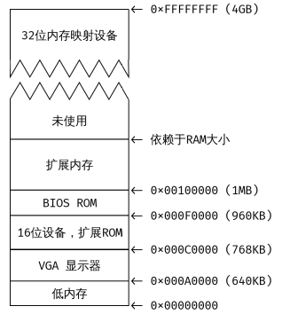

# Exercise 1 
> 问题：熟悉6.828参考页上提供的汇编语言材料。不必阅读它们，但在阅读和编写x86汇编程序时，几乎肯定会想要参考其中的一些材料。
> 
> 解答：建议阅读Brennan的内联汇编指南中的["语法"](http://www.delorie.com/djgpp/doc/brennan/brennan_att_inline_djgpp.html)部分。它对我们将在JOS中与GNU汇编器一起使用的AT&T汇编语法进行了很好的(而且相当简短)描述。

# Exercise 2
x86计算机的内存布局如图所示



在一个终端下执行 make qemu-gdb 指令，然后新建一个 terminal，执行 make gdb 指令，结果如
图1.3所示（此处使用的是 cgb，便于调试，此后的调试也将使用 cgdb 而不是 gdb）。可以看到，gdb 已
经开始调试并停止在 0xffff0 处。而这条指令就是 PC 启动后 BIOS 执行的第一条指令。

第一条指令表明：
- IBM PC 执行的起始物理地址为 0x000ffff0
- PC 的偏移方式为 CS = 0xf000，IP = 0xfff0
- 第一条指令执行的是 jmp 指令，跳转到段地址 CS = 0xf000，IP = 0xe05b

> 问题： 使用 GDB 的 si 命令单步调试进入 ROM BIOS，然后猜测这些指令的作用。
>
> 解答： 在使用 make qemu-gdb 命令编译内核并启动 qemu，然后使用 make gdb 命令启动 gdb 后，使用 si 单步调试。连续执行 si 命令多步后，得到的前 30 条指令如下：
```
1 0xffff0: ljmp $0xf000, $0xe05b
2 0xfe05b: cmpl $0x0, $cs:0x6ac8
3 0xfe062: jne 0xfd2e1
4 0xfe066: xor %dx, %dx
5 0xfe068: mov %dx, %ss
6 0xfe06a: mov $0x7000, %esp
7 0xfe070: mov $0xf34d2,%edx
8 0xfe076: jmp 0xfd15c
9 0xfd15c: mov %eax, %ecx
10 0xfd15f: cli
11 0xfd160: cld
12 0xfd161: mov $0x8f, %eax
13 0xfd167: out %al, $0x70
14 0xfd169: in $0x71, %al
15 0xfd16b: in $0x92, %al
16 0xfd16d: or $0x2, %al
17 0xfd16f: out %al, $0x92
18 0xfd171: lidtw %cs:0x6ab8
19 0xfd177: lgdtw %cs:0x6a74
20 0xfd17d: mov %cr0, %eax
21 0xfd180: or $0x1, %eax
22 0xfd184: mov %eax, %cr0
23 0xfd187: ljmpl $0x8, $0xfd18f
24 0xfd18f: mov $0x10, %eax
25 0xfd194: mov %eax, %ds
26 0xfd196: mov %eax, %es
27 0xfd198: mov %eax, %ss
28 0xfd19a: mov %eax, %fs
29 0xfd19c: mov %eax, %gs
30 0xfd19e: mov %ecx, %eax
```

> - 第 1 条指令是一条跳转指令，跳转到 0xfe05b 处。
> - 第 2 条和第 3 条指令共同构成了判断跳转，如果 $cs:0x6ac8 处的值不为 0 则跳转，而根据第 4 条指令的地址可以得知此处并没有发生跳转。
> - 第 4 跳指令将%dx 清零。
> - 第 5~8 条指令在设置完段寄存器、段指针以及 edx 寄存器后跳转到了 0xfd15c 处。然后第 10 跳指令关闭了中断。这应该是由于 boot 过程是比较关键的，因此屏蔽大部分的中断。
> - 第 11 跳指令设置了方向标志位，表示后续操作的内存变化方向。
> - 第 12~14 条指令涉及到 IO 操作。CPU 与外部设备通讯需要通过 IO 端口访问，而 x86CPU 使 用 IO 端口独立编址的方式。并且规定端口操作需要通过 al 或者 ax 进行。通过查询端口对应的设备2我们知道了 0x70 和 0x71 是用于操作 CMOS 的端口。而这三条指令是用于关闭不可屏蔽中断 (Non-Maskable Interrupt) 的。
> - 第 18 和 19 条指令用于将 0xf6ab8 处的数据读入到中断向量表寄存器 (IDTR) 中，并将 0xf6a74的数据读入到全局描述符表格寄存器 (GDTR) 中，而后者是实现保护模式中较为重要的一部分。
> - 第 20~21 用于将 CR0 寄存器的最低位置 1，进入保护模式，然而后面又从保护模式退出，继续在实模式下运行。
> - 第 23~29 步用于重新加载段寄存器，在加载完 GDTR 寄存器后需要刷新所有的段寄存器的值3 。